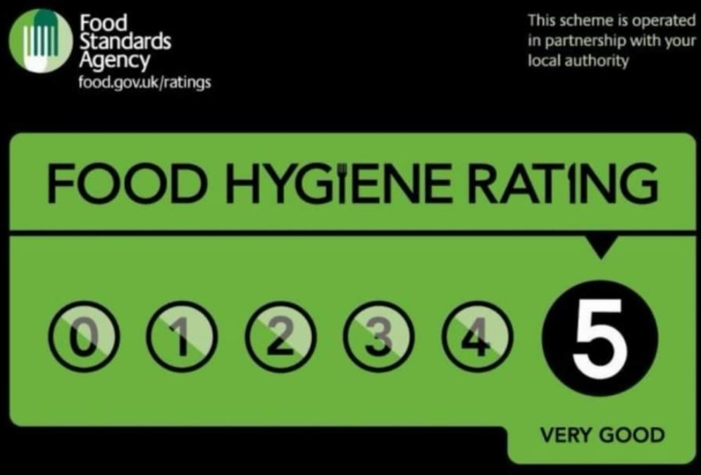

This is an example of the food we offer to the children each week.

| Day       | Afternoon Food                                     |
|-----------|----------------------------------------------------|
| Monday    | Hot-dogs                                           |
| Tuesday   | Filled Rolls                                       |
| Wednesday | Pancakes/scones/crumpets                           |
| Thursday  | Wraps                                              |
| Friday    | Crackers with cheese or ham/beams on toast/brioche |



We offer fresh fruit and vegetables every weekday, as well as Toast, croissants cereal with milk or juice and a selection of spreads every weekday morning.

We do cater for allergies as long as we are aware of them



###### Our Food Hygiene Rating:

