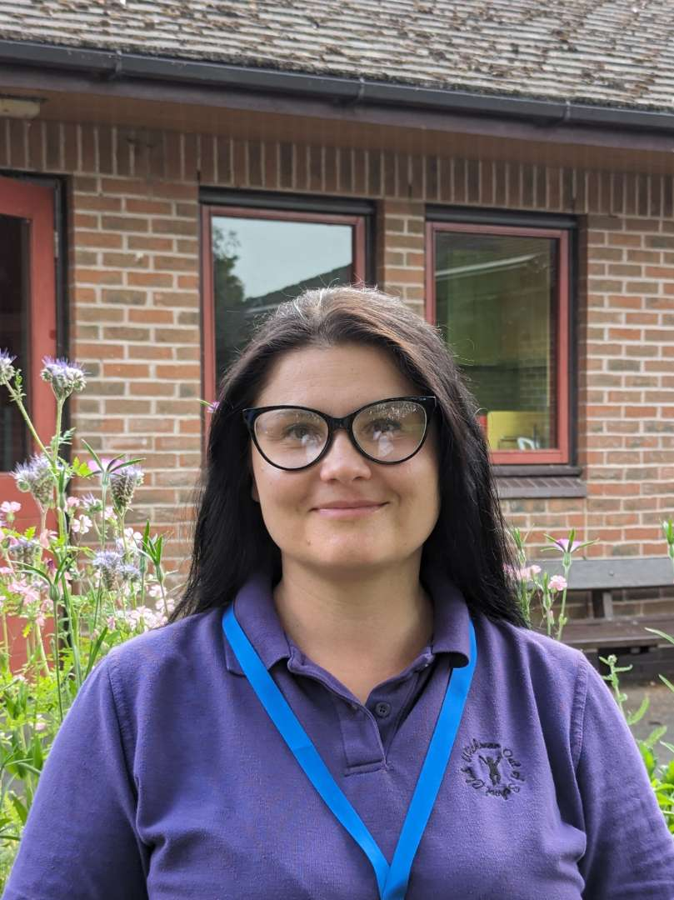



### Mary Simmons
#### Business Manager

I joined the WOOSC team as Business Manager in 2020 and enjoy working within a close-knit team of people.





### Hilary Turner
#### Day Manager

With 25 years of experience in education and SEND,
I believe play should be assessable to all children in order for them to learn and grow
and develop healthy bodies.





### Connie Harris
#### Play worker





### Pat Trull
#### Play worker





### Yanina Bezvekhniei
#### Play worker





### Sophia Turner
#### Play worker





### Ayse Ozer
#### Play worker


